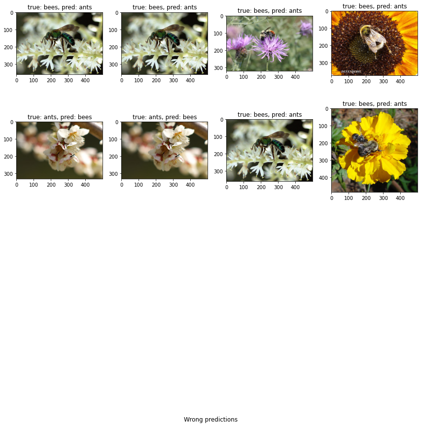

## Pytorch tutorials/excercises
* Pytorch CV apps to get started with.
* Covers creating linear reg model, ANN,CNN for classification with MNIST, CIFAR10, Ants vs Bees
* Goal is not to get the best accuracy, but to get hands dirty with some real examples

---

*Wrong classification results from Ants vs bees model*

